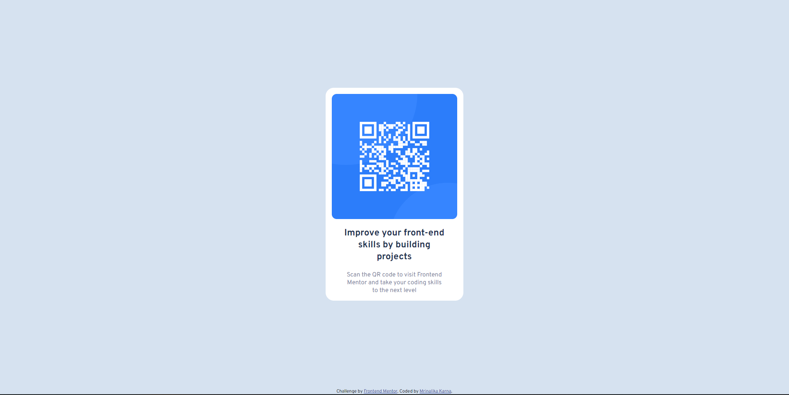

# Frontend Mentor - QR code component solution

This is a solution to the [QR code component challenge on Frontend Mentor](https://www.frontendmentor.io/challenges/qr-code-component-iux_sIO_H). 

### Screenshot

### Links

- Solution URL: [https://github.com/MrinalikaKarna/QRCodeComponent](https://github.com/MrinalikaKarna/MrinalikaKarna.github.io)
- Live Site URL: [https://MrinalikaKarna.github.io](https://MrinalikaKarna.github.io)

## My process

### Built with

- Semantic HTML5 markup
- CSS custom properties
- Flexbox
- Mobile-first workflow

## Author

- Frontend Mentor - [@MrinalikaKarna](https://www.frontendmentor.io/profile/MrinalikaKarna)

